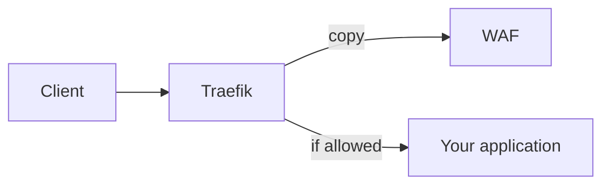

# 🛡️ Traefik ModSecurity Plugin

[](https://github.com/david-garcia-garcia/traefik-modsecurity/actions/workflows/build.yml)
[](https://goreportcard.com/report/github.com/david-garcia-garcia/traefik-modsecurity)
[](https://img.shields.io/github/go-mod/go-version/david-garcia-garcia/traefik-modsecurity)
[](https://github.com/david-garcia-garcia/traefik-modsecurity/releases/latest)
[](LICENSE)

A Traefik plugin that integrates with [OWASP ModSecurity Core Rule Set (CRS)](https://github.com/coreruleset/coreruleset) to provide Web Application Firewall (WAF) protection for your applications.

> [!TIP]
> 
> **Traefik Security**
> 
> The basic middlewares you need to secure your Traefik ingress:
> 
> 🌍 **Geoblock**: [david-garcia-garcia/traefik-geoblock](https://github.com/david-garcia-garcia/traefik-geoblock) - Block or allow requests based on IP geolocation  
> 🛡️ **CrowdSec**: [maxlerebourg/crowdsec-bouncer-traefik-plugin](https://github.com/maxlerebourg/crowdsec-bouncer-traefik-plugin) - Real-time threat intelligence and automated blocking  
> 🔒 **ModSecurity CRS**: [david-garcia-garcia/traefik-modsecurity](https://github.com/david-garcia-garcia/traefik-modsecurity) - Web Application Firewall with OWASP Core Rule Set  
> 🚦 **Ratelimit**: [Traefik Rate Limit](https://doc.traefik.io/traefik/reference/routing-configuration/http/middlewares/ratelimit/) - Control request rates and prevent abuse

> [!WARNING]
>
> **You should not run middlewares as Yaegi plugins in production.**
>
> Traefik's default plugin system runs plugins via [Yaegi](https://github.com/traefik/yaegi) (a Go interpreter) at runtime. Middlewares run on every request, so they sit on the hot path. Using an interpreter for that workload has concrete drawbacks related to memory management, CPU usage and observability (see [feat: improve pprof experience by adding wrappers to interpreted functions by david-garcia-garcia · Pull Request #1712 · traefik/yaegi](https://github.com/traefik/yaegi/pull/1712))
>
> For production deployments where middlewares handle substantial traffic, use a Traefik build that **compiles those middlewares into the binary** instead of loading them as Yaegi plugins such as in [david-garcia-garcia/traefik-with-plugins: Traefik container with preloaded plugins in it](https://github.com/david-garcia-garcia/traefik-with-plugins)
>
> **For more details and discussion, read [Traefik issue #12213](https://github.com/traefik/traefik/issues/12213) in the Traefik issue queue.**

[Traefik ModSecurity Plugin](#-traefik-modsecurity-plugin)

- [Demo](#demo)
- [Usage (docker-compose.yml)](#usage-docker-composeyml)
- [Architecture](#architecture)
- [How it works](#how-it-works)
- [Trust this middleware (client IP in WAF logs)](#trust-this-middleware-client-ip-in-waf-logs)
- [Testing](#-testing)
- [Configuration](#️-configuration)
- [Local development](#local-development-docker-composelocalyml)

## Demo

Demo with WAF intercepting relative access in query param.


## Usage (docker-compose.yml)

See [docker-compose.yml](docker-compose.yml)

1. docker-compose up
2. Go to http://localhost/website, the request is received without warnings
3. Go to http://localhost/website?test=../etc, the request is intercepted and returned with 403 Forbidden by
   owasp/modsecurity
4. You can you bypass the WAF and check attacks at http://localhost/bypass?test=../etc

## Architecture

Every request goes through Traefik. This plugin sends a **copy** to the WAF. If the WAF allows it, Traefik forwards the original request to **your** application. If the WAF blocks it, the client gets that block and your app is never called.

The `whoami` containers in the demo are only sample websites. Swap them for your real services. The WAF container is inspect-only: after CRS request phases it answers HTTP 200. It does **not** reverse-proxy to a second site.



| Box | What it is |
| --- | --- |
| Traefik | Reverse proxy. Runs this plugin. |
| WAF | ModSecurity CRS container. Looks at the copy and says allow or block. |
| Your application | The real site or API. Demo uses `whoami` as a placeholder. |

### What to expect (speed)

Treat them as a ballpark, not a promise. Inspect-only drain (no extra origin hop):

| Setup | GET | POST |
| --- | --- | --- |
| Apache | ~5200 req/s (10 ms) | ~1350 req/s (37 ms) |
| nginx | ~3600 req/s (14 ms) | ~2550 req/s (20 ms) |

## How it works

The plugin classifies the sidecar HTTP status (see [Architecture](#architecture) for the service layout):

- **2xx** — allow: write `ok` on `modSecurityStatusRequestHeader` when that name is set, then forward the request to the real service.
- **3xx / 4xx** — security block: copy the sidecar response to the client, omitting hop-by-hop headers (`Connection`, `Keep-Alive`, `Transfer-Encoding`, `Upgrade`, `Proxy-*`, `Te`, `Trailer`) and `Server`. The body is whatever page ModSecurity produced — operators who customize that page or enable verbose reporting should treat it as client-visible. When `modSecurityStatusRequestHeader` is set, write `blocked`.
- **5xx** — WAF failure, not a block: set `modSecurityStatusRequestHeader` to `error` when configured, count a health-tracker failure, then fail-open or return 502. The sidecar 5xx body is not forwarded.

## Trust this middleware (client IP in WAF logs)

Copying headers is not enough for ModSecurity to treat the visitor as the client. `REMOTE_ADDR` (audit logs, error logs, IP collections, and any IPS that parses those logs) stays the **Traefik-to-sidecar TCP hop** until CRS is told to trust Traefik.

What this plugin sends to `modSecurityUrl`:

- Sets the sidecar request `Host` to the incoming `Host`.
- Copies Traefik’s headers as-is, including `X-Real-Ip` when Traefik already set it, and leftover `X-Forwarded-For` only if Traefik left one.
- Does **not** append `RemoteAddr` to `X-Forwarded-For`.
- Does **not** set `X-Real-IP`.

Traefik’s entrypoint `forwardedheaders` is the source of truth (`X-Real-Ip`; leftover XFF only if the peer is trusted). CRS / ModSecurity does **not** read those headers as `REMOTE_ADDR` on its own.

### Apache CRS (demo compose)

Use [docker-compose.yml](docker-compose.yml) as the reference. The `waf` service sets:

```yaml
REMOTEIP_HEADER: X-Real-IP
REMOTEIP_INT_PROXY: 10.0.0.0/8 172.16.0.0/12 192.168.0.0/16
```

`REMOTEIP_INT_PROXY` must include the network Traefik uses to reach the sidecar (Docker bridge is usually `172.16.0.0/12`). The image default `10.1.0.0/16` does not. Do **not** set `0.0.0.0/0`.

The shipped `4.3.0-apache-alpine-202406090906` pin hardcodes `RemoteIPHeader X-Forwarded-For`, so `REMOTEIP_HEADER` alone does nothing. Compose also mounts [crs-apache/httpd-vhosts.drain.conf](crs-apache/httpd-vhosts.drain.conf) (inspect-only 200 after CRS, `RemoteIPHeader X-Real-IP`).

### nginx CRS (test compose is the reference)

Use [docker-compose.test.nginx.yml](docker-compose.test.nginx.yml). The official image maps:

```yaml
REAL_IP_HEADER: X-Real-IP
SET_REAL_IP_FROM: 10.0.0.0/8,172.16.0.0/12,192.168.0.0/16
REAL_IP_RECURSIVE: on
```

Those become `real_ip_header X-Real-IP` and `set_real_ip_from` for the Traefik net. `SET_REAL_IP_FROM` is comma-separated. Do **not** set `0.0.0.0/0`.

The shipped `4.3.0-nginx-alpine-202406090906` pin applies those env vars only inside `location /`, which is too late for ModSecurity. Compose also mounts [crs-nginx/realip.conf](crs-nginx/realip.conf) at http level. Inspect-only origin: [crs-nginx/drain-origin.conf](crs-nginx/drain-origin.conf) on `127.0.0.1:18081` (`BACKEND=http://127.0.0.1:18081`) and [crs-nginx/proxy_backend.drain.conf.template](crs-nginx/proxy_backend.drain.conf.template) so `If-None-Match` cannot 304 the tiny 200. Do not put `return` on CRS `location /` (that skips request-body inspection). The nginx user cannot write `/var/log`; the test compose sets `MODSEC_AUDIT_LOG=/tmp/modsecurity/modsec_audit.log`.

Operators who set Traefik `forwardedHeaders.trustedIPs` and want leftover XFF as `REMOTE_ADDR` configure that on CRS themselves (`REMOTEIP_HEADER=X-Forwarded-For` or `REAL_IP_HEADER=X-Forwarded-For`).

Without this, every deny is attributed to the Traefik container IP. An IPS that blocks from the WAF log then bans Traefik, not the attacker.

## Testing

### Integration Tests

Run the complete test suite against real Docker services:

```bash
# Apache CRS inspect-only (default)
./Test-Integration.ps1

# nginx CRS inspect-only
./Test-Integration.ps1 -Stack nginx-drain

# Both stacks
./Test-Integration.ps1 -AllStacks

# Keep services running for debugging
./Test-Integration.ps1 -SkipDockerCleanup
```

**Prerequisites:** Docker, Docker Compose, PowerShell 7+

### Unit Tests

```bash
# Run unit tests
go test -v

# Run with coverage
go test -v -cover
```

### Performance Benchmarks

```bash
# Local benchmarks
go test -bench=. -benchmem

# Integration performance testing
docker compose -f docker-compose.test.yml up -d
go test -bench=BenchmarkProtectedEndpoint -benchmem
```

## ⚙️ Configuration

```yaml
http:
  middlewares:
    waf-middleware:
      plugin:
        modsecurity:
          #-------------------------------
          # Basic Configuration
          #-------------------------------
          modSecurityUrl: "http://modsecurity:80"
          # REQUIRED: URL of the ModSecurity container
          # This is the endpoint where the plugin will forward requests for security analysis
          # Examples:
          # - "http://modsecurity:80" (Docker service name)
          # - "http://localhost:8080" (Local development)
          # - "https://waf.example.com" (External service)
          
          logLevel: info
          # OPTIONAL: Plugin-owned log level (Traefik --log.level does not reach this middleware)
          # Default: info
          # Accepted: debug, info, warn, error
          # error: cannot read body, cannot reach ModSecurity
          # warn: health trip (expected backoff)
          # info: health backoff expiry (default; production-quiet)
          # debug: also reclaim_put / reclaim_bind / reclaim_dispose
          # Invalid values fail plugin construction
          
          timeoutMillis: 2000
          # OPTIONAL: Timeout in milliseconds for ModSecurity requests
          # Default: 2000ms (2 seconds)
          # This controls how long the plugin waits for ModSecurity to respond
          # Increase for slow ModSecurity instances or large payloads
          # Set to 0 for no timeout (not recommended in production)
          
          unhealthyWafBackOffPeriodSecs: 30
          # OPTIONAL: Backoff period in seconds when ModSecurity is unavailable
          # Default: 0 (return 502 Bad Gateway immediately)
          # When ModSecurity is down, this plugin can temporarily bypass it
          # Set to 0 to disable bypass (always return 502 when WAF is down)
          # Set to 30+ seconds for production environments with automatic failover
          # Omitted unhealthyWafFailureThreshold defaults to 5 (one error does not trip)
          # Omitted unhealthyWafFailureWindowSecs defaults to 10 (tumbling window)
          # Set unhealthyWafFailureThreshold: 1 to trip on the first sidecar error
          
          modSecurityStatusRequestHeader: "X-Waf-Status"
          # OPTIONAL: Header name to add to requests for logging purposes
          # Default: empty (no header added)
          # This header is added to the REQUEST (not response) for Traefik access logs
          # Header values (coarse WAF status for access logs; not HTTP status codes):
          # - "ok" when the sidecar allows the request
          # - "blocked" when the sidecar returns 3xx/4xx, or this plugin rejects an oversize body
          # - "error" when the sidecar is unreachable, returns 5xx, or the sidecar request cannot be built
          # - "unhealthy" when ModSecurity is down and backoff is already tripped
          # - "bypassrule" when a bypassRules entry matched (sidecar was not called)
          # Configure Traefik access logs to capture this header:
          # accesslog.fields.headers.names.X-Waf-Status=keep

          bypassRules: []
          # OPTIONAL: Skip the sidecar for matching method+path patterns (no body buffer, no WAF hop)
          # Default: empty (inspect every request, subject to WebSocket and unhealthy skips)
          # Each entry:
          #   method: HTTP method (case-insensitive). Empty = any method
          #   pathRegexp: Go RE2 regexp matched against the URL path (not the query). Empty = any path
          # Both set: both must match. MatchString is unanchored (`health` matches `/unhealthy`);
          # write `^/health$` for an exact path.
          # Invalid pathRegexp fails plugin construction.
          # Example:
          # bypassRules:
          #   - method: GET
          #     pathRegexp: ^/admin/
          #   - pathRegexp: /healthz
          # When modSecurityStatusRequestHeader is set, matching requests get "bypassrule"
          
          #-------------------------------
          # Advanced Transport Configuration
          #-------------------------------
          # These parameters fine-tune HTTP client behavior for high-load scenarios
          # Leave at defaults unless you're experiencing performance issues
          
          maxConnsPerHost: 100
          # OPTIONAL: Maximum concurrent connections per ModSecurity host
          # Default: 0 (unlimited connections)
          # Controls connection pool size to prevent overwhelming ModSecurity
          # Recommended: 50-200 for most environments
          # Set to 0 for unlimited (original behavior)
          
          maxIdleConnsPerHost: 10
          # OPTIONAL: Maximum idle connections to keep per ModSecurity host
          # Default: 0 (unlimited idle connections)
          # Idle connections are kept alive for reuse, reducing connection overhead
          # Recommended: 5-20 for most environments
          # Set to 0 for unlimited (original behavior)
          
          responseHeaderTimeoutMillis: 5000
          # OPTIONAL: Timeout for waiting for response headers from ModSecurity
          # Default: 0 (no timeout)
          # This is different from timeoutMillis - it only waits for headers, not full response
          # Useful for detecting slow ModSecurity instances quickly
          # Set to 0 to disable (original behavior)
          
          expectContinueTimeoutMillis: 1000
          # OPTIONAL: Timeout for Expect: 100-continue handshake
          # Default: 1000ms (1 second)
          # Used when sending large payloads - ModSecurity can reject before full upload
          # Increase for very large files or slow networks
          # This is the only parameter that has a non-zero default
          
          maxBodySizeBytes: 5242880
          # OPTIONAL: Maximum request body size in bytes
          # Default: 5242880 (5 MB)
          # Security feature to prevent DoS attacks via large request bodies
          # Requests exceeding this limit will return HTTP 413 Request Entity Too Large
          # Set to 0 for unlimited (not recommended in production)
          # Common values:
          # - 1048576 (1 MB) for APIs
          # - 5242880 (5 MB) for general use
          # - 10485760 (10 MB) for file uploads
          # - 52428800 (50 MB) for large file processing
          
          denyVerbsWithBody: ["HEAD", "GET", "DELETE", "OPTIONS", "TRACE", "CONNECT"]
          # OPTIONAL: HTTP methods that must not carry a request body
          # Default: ["HEAD", "GET", "DELETE", "OPTIONS", "TRACE", "CONNECT"]
          # When a listed method has a body, the plugin returns HTTP 400. It does not
          # call ModSecurity and it does not call the next handler, including when the
          # WAF is already unhealthy. Methods not on this list are inspected and forwarded.
          #
          # Omitted uses this default. An explicit empty list denies nothing (GET-with-body
          # is inspected like POST). To allow GET-with-body while keeping the other defaults,
          # omit GET from the list. The old keys ignoreBodyForVerbs and ignoreBodyForVerbsDeny
          # are removed; leftover YAML for those keys is ignored.
          
          maxBodySizeBytesForPool: 4194304
          # OPTIONAL: Threshold above which to use ad-hoc allocation instead of pool
          # Default: 5242880 (5 MB)
          # Memory optimization: prevents pool pollution with large buffers
          # 
          # How it works:
          # - Uses req.ContentLength (the parsed size; -1 means unknown, e.g. chunked)
          # - If ContentLength >= 0 and <= threshold: uses pooled bytes.Buffer
          # - If ContentLength > threshold: uses io.ReadAll with ad-hoc allocation
          # - If ContentLength is -1: still uses the pool for the read
          # - After a pooled read, the buffer is returned only when its capacity is <= threshold
          # 
          # Benefits:
          # - Keeps pool efficient for common small requests
          # - Prevents large buffers from staying in pool
          # - Reduces GC pressure from oversized pooled objects
          # - Optimizes memory usage patterns
```


## Local Development

See [docker-compose.local.yml](docker-compose.local.yml) for local development setup.

```bash
# Start development environment
docker-compose -f docker-compose.local.yml up

# Run tests before committing
go test -v && ./Test-Integration.ps1
```
