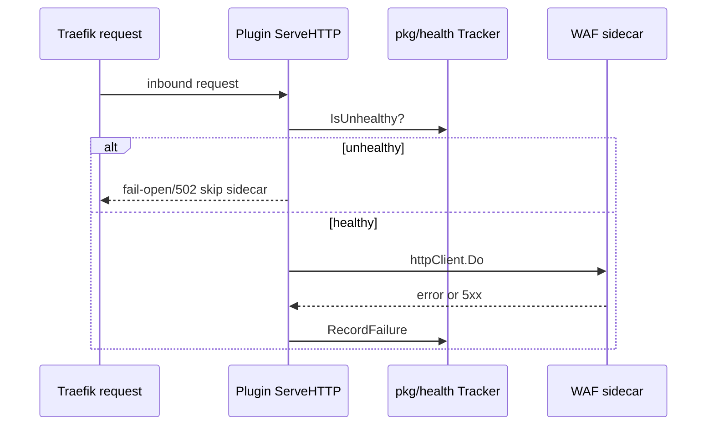

Developer review: in progress — 2026-09-16T19:13:17Z

## What this changes
**Operators.** None yet — prepare only; existing unhealthy WAF JSON knobs stay as on `main` until implement.

**Admin users.** None.

**Developers.** None on product code yet; bus `requirement.md` and upstream `backendbackoff` research added on branch.

**End users.** None.

## Motivation
The ModSecurity plugin still carries a local `pkg/health` failure counter while the shared utilities module already publishes a Yaegi-safe backend backoff gate with half-open probe recovery. On `main`, repeated sidecar failures trip a fixed tumbling window and fixed cooldown that diverge from upstream semantics and test depth.

If we keep the fork, operator backoff behavior and probe recovery can drift from other Traefik middlewares that share the same utilities repo, and regressions in trip/recover paths stay easier to miss.

## Merge readiness
Prepare complete; explore not started. 1 item remains.

Priority: P2 — real operator pain when the WAF sidecar flaps, with fail-open limiting blast radius today.

Reviewed head: fe7977a
Owner decision: None.

## Review scores
| Measure | Result | What it means |
| --- | --- | --- |
| Overall readiness | 1/6 | Bus only; no product change yet |
| CI proof | 1 | Pushed; checks not seen |
| Local tests proof | N/A | Before implement |
| Review resolution | N/A | No PR comments inventoried |

## Verification
| Check | Result | Evidence |
| --- | --- | --- |
| Branch | 2026-09-16-upstream-health-probe pushed | git push |
| OpenSpec | none | handoff.yaml |
| Pull request | https://github.com/david-garcia-garcia/traefik-modsecurity/pull/48 | GitHub |
| CI | not seen | not measured |
| Local tests | none | handoff.yaml |
| PR comments | no comments | comments: none |

## Specs
None.

## Deviations from the ask
None.

## Follow-up issues
None.

## How this fits together
Local ticket spec → branch `2026-09-16-upstream-health-probe` → stub PR #48 → CI pending.

## Explore Decisions
None.

## Before merge
- [ ] [P2] Run explore to map existing unhealthy JSON fields onto `backendbackoff.Config` and decide public knob surface.

## Findings
None.

## Axis review
None.

## Agent review details

### Stored data model
None.
